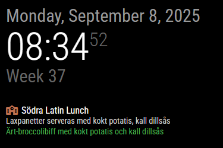

# MMM-SchoolLunch

A [MagicMirror²](https://magicmirror.builders/) module that displays today’s school lunch menu from [Matilda Platform](https://menu.matildaplatform.com/) for schools in Sweden.

---

## ✨ Features
- Shows today’s main lunch and optional vegetarian option.  
- Configurable school (via ID from Matilda Platform).  
- Configurable module title.  
- Optional icon in the title.  
- Configurable update interval.  
- Customizable fallback text when no menu is available.  
- Fully styleable via `custom.css`.

---

## 🔗 Finding Your School
1. Go to [Matilda Platform](https://menu.matildaplatform.com/).  
2. Search for your school and open its page.  
3. Copy the **ID from the URL**. Example:  

https://menu.matildaplatform.com/sv/meals/67f610892852a0caabdf111b_sodra-latins-gymnasium

Here, the school ID is:
67f610892852a0caabdf111b_sodra-latins-gymnasium

4. Use that ID in the `config.js` file under `schoolId`.

---

## ⚙️ Installation
Clone the module into your MagicMirror modules folder:
```
cd ~/MagicMirror/modules
git clone https://github.com/SWhardfish/MMM-SchoolLunch.git
```


## 🛠 Configuration

Add the module to the modules array in your config.js:

```
{
  module: "MMM-SchoolLunch",
  position: "top_left",
  config: {
    schoolId: "67f610892852a0caabdf111b_sodra-latins-gymnasium",
    title: "Södra Latin Lunch",
    symbol: "school",         // optional icon (Font Awesome)
    symbolColor: "#BE6F4E",   // optional icon color
    showVegetarian: true,     // show or hide vegetarian option
    updateInterval: 3 * 60 * 60 * 1000, // refresh every 3 hours
    fallbackText: "No lunch available"
  }
}
```

## 🎨 Custom CSS

You can adjust styling in your custom.css file. Example:

```
/* === School Lunch module === */
.MMM-SchoolLunch {
  margin-bottom: 30px;
}

.MMM-SchoolLunch .schoolLunchTitle {
  display: block !important;
  font-size: 16px !important;
  color: #fff;
  margin: 0 0 2px 0;
}

.MMM-SchoolLunch .schoolLunchItem {
  display: block !important;
  font-size: 14px !important;
  margin: 0 0 2px 0;
  color: #ccc;
}

.MMM-SchoolLunch .schoolLunchVeg {
  display: block !important;
  font-size: 14px !important;
  margin: 0 0 2px 0;
  color: #4CAF50 !important;
}

.MMM-SchoolLunch .schoolLunchItem.noLunch {
  color: #999;       /* fallback text styling */
  font-style: italic;
}

.MMM-SchoolLunch .schoolLunchTitle,
.MMM-SchoolLunch .schoolLunchItem,
.MMM-SchoolLunch .schoolLunchVeg {
  line-height: 1.1em;
}
```

## 📸 Screenshot


## 🔧 Configurable Options

| Option           | Type        | Default              | Description                                          |
| ---------------- | ----------- | -------------------- | ---------------------------------------------------- |
| `schoolId`       | String      | *(none)*             | The ID of your school from the Matilda Platform URL. |
| `title`          | String      | "School Lunch"       | The title displayed at the top of the module.        |
| `symbol`         | String      | *(none)*             | Optional Font Awesome icon name (e.g. `"school"`).   |
| `symbolColor`    | String      | *(none)*             | Optional CSS color for the icon (e.g. `"#BE6F4E"`).  |
| `showVegetarian` | Boolean     | `true`               | Show or hide the vegetarian option.                  |
| `updateInterval` | Number (ms) | `6 * 60 * 60 * 1000` | How often the menu should refresh (in ms).           |
| `fallbackText`   | String      | "No lunch today"     | Text shown when no lunch is available.               |


## 📜 License

This project is licensed under the MIT License - see the [LICENSE](LICENSE.md) file for details.
